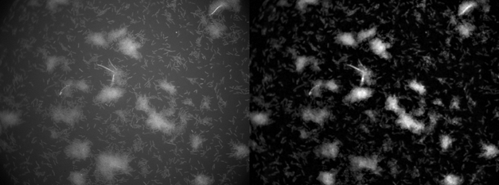
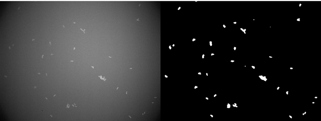

# Project: study of gene expression in biofilms of E. coli from light sheet microscopy
## Protocol
### Graphic Explanation
#### Confocal Microscopy
1.	Filter the images using a median filter

 
 
 
2.	Make a Morphological Grayscale Reconstruction

 

3.	Binarize the image using a triangle threshold to create a mask
 
  
 
4.	Open the mask, to remove small artifacts

 

#### SPIM Microscopy
1.	Filter the images using a median filter

 
 
 
 
2.	Make a Morphological Grayscale Reconstruction

 

3.	Binarize the image using a triangle threshold to create a mask

 

4.	Open the mask, to remove small artifacts

#### Nikon Microscopy
1.	Make an adaptative contrast equalization 

 
 
2.	Open to remove salt noise
 
  
 

3.	Use a median filter

 
 
4.	Use a White top hat filter

 
 
 
5.	Binarize using Triangle Threshold

 
 
6.	Open the mask to remove small artifacts

 
 
 
### Paragraph
#### Confocal Microscopy (planes 20-30)
First, because the images are in 16-bits formats, they are rescaled to be in 8-bit format. Then, the images are filtered with a median filter using as the structural element a disk with a 3-pixel radius. Next, to completely remove the background, a morphological grayscale reconstruction is performed on the images, using as the seed the minimum points on the image that are found on a disk with a 4-pixel radius, as the mask the image and as the method dilation. Then, the resulting images are binarized using a triangle threshold. And finally, the binarized images are open with a disk of radius 1-pixel, to remove small artifacts
|                                               |     Function                              |     Parameters                                                                                                                         |
|-----------------------------------------------|-------------------------------------------|----------------------------------------------------------------------------------------------------------------------------------------|
|     Rescale                                   |     skimage.exposure.rescale_intensity    |     Image = bacteria images     out_range = (0,255)                                                                                    |
|     Median filter                             |     skimage.filters.rank.median           |     image = rescaled bacteria   images     selem  = skimage.morphology.disk(3)                                                         |
|     Morphological grayscale reconstruction    |     skimage.morphology.reconstruction     |     seed =   skimage.rank.minimum(image,    skimage.morphology.disk(4))     mask = filtered bacteria   images     method = dilation    |
|     Binarization                              |     skimage.filters.threshold_triangle    |     Image = reconstructed   bacteria images                                                                                            |
|     Opening                                   |     skimage.morphology.opening            |     Image = binarized bacteria   images     selem = skimage.morphology.disk(1)                                                         |

#### SPIM Microscopy (Planes 11-20)
The procedure is similar to the one used in the images of Confocal microscopy. First, because the images are in 16-bits formats, they are rescaled to be in 8-bit format. Then, the images are filtered with a median filter using as the structural element a disk with a 3-pixel radius. Next, to completely remove the background, a morphological grayscale reconstruction is performed on the images, using as the seed the local minima on the image, as the mask the image and as the method dilation. Then, the resulting images are binarized using a triangle threshold. And finally, the binarized images are open with a disk of radius 3-pixel, to remove small artifacts.
|                                                 |     Function                              |     Parameters                                                                                                            |
|-------------------------------------------------|-------------------------------------------|---------------------------------------------------------------------------------------------------------------------------|
|     Rescale                                     |     skimage.exposure.rescale_intensity    |     Image = bacteria images     out_range = (0,255)                                                                       |
|     Median filter                               |     skimage.filters.rank.median           |     image = rescaled bacteria   images     selem  = skimage.morphology.disk(3)                                            |
|     Morphological grayscale   reconstruction    |     skimage.morphology.reconstruction     |     seed = image * skimage.morphology.local_.minima(image)     mask = filtered bacteria   images     method = dilation    |
|     Binarization                                |     skimage.filters.threshold_triangle    |     Image = reconstructed   bacteria images                                                                               |
|     Opening                                     |     skimage.morphology.opening            |     Image = binarized bacteria   images     selem =   skimage.morphology.disk(3)                                          |

#### Nikon Microscopy (planes 14-22)
First, the images are equalized with an adaptative contrast equalization (CLAHE) using as clipLimit 20 and tileGridSize (8,8). Next, to remove the salt noise the image is opened using as the structural element a disk with a 3-pixel radius. The resulted image is rescaled and then filtered with a median filter with a disk with a 3-pixel radius. Then, a white top hat operation is applied using a structural element that changes size according to the time (time*2+10),assuming that the bacteria grow over time. Then, the resulting images are binarized using a triangle threshold. And finally, the binarized images are open with a disk of radius 3-pixel, to remove small artifacts.

|                       |     Function                                  |     Parameters                                                                              |
|-----------------------|-----------------------------------------------|---------------------------------------------------------------------------------------------|
|     CLAHE             |     clahe =cv2.createCLAHE     clahe.apply    |     clipLimit = 20.0     tileGridSize = (8,8)     clahe.apply(bacteria   images)            |
|     Opening           |     skimage.morphology.opening                |     Image = equalized bacteria   images     selem =   skimage.morphology.disk(3)            |
|     Rescale           |     skimage.exposure.rescale_intensity        |     Image = opened bacteria   images     out_range = (0,255)                                |
|     White Top Hat     |     skimage.morphology.white_tophat           |     image = rescaled bacteria   images     selem  = skimage.morphology.disk(time *2 +10)    |
|     Binarization      |     skimage.filters.threshold_triangle        |     Image = white top hat   bacteria images                                                 |
|     Opening           |     skimage.morphology.opening                |     Image = binarized bacteria   images     selem =   skimage.morphology.disk(3)            |
## Results
### Confocal Microscopy
#### Average intensity

 

#### Grow 

  

### Nikon Microscopy
#### Average intensity

  

#### Grow 

  

### SPIM Microscopy 
#### Average intensity

  

#### Grow 

 
  
